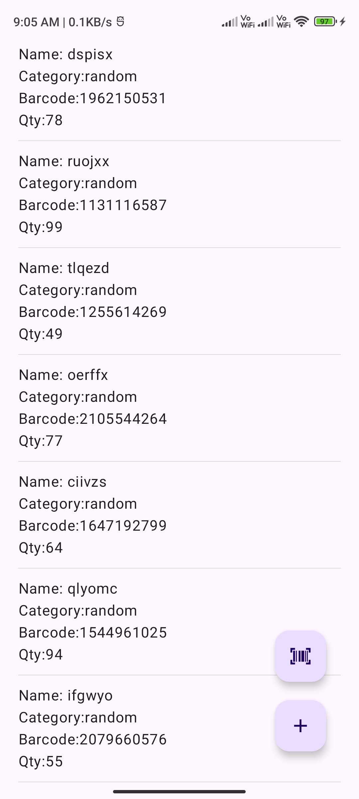
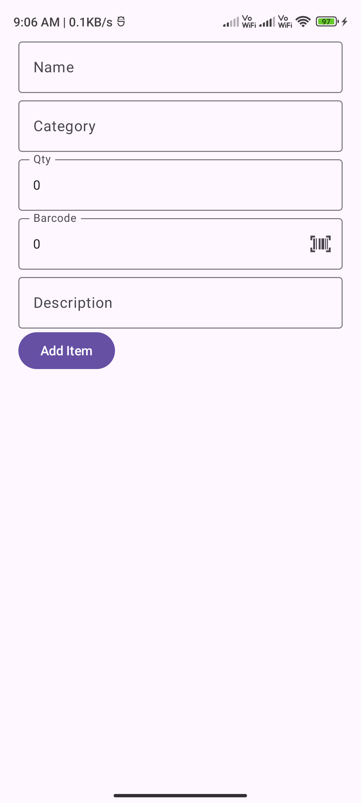

# 📦 InfoManager

**InfoManager** is a modern, lightweight Android application designed for **inventory management**,
featuring seamless **barcode scanning** powered by **ML Kit**. Built using modern Android
development tools and architectural best practices, this app allows users to efficiently manage and
track their inventory in real-time.

[🎥 Watch Demo](https://youtube.com/shorts/JWv972vaMu0?feature=share)
  
---  

## ✨ Features

- 🔍 **Barcode Scanning**    
  Quickly scan product barcodes using **Google ML Kit** for fast and reliable item entry.

- 🗃️ **Inventory Management**    
  Add, update, and delete items in your inventory using a clean, intuitive interface.

- 🧠 **Local Database**    
  Stores item data persistently using **Room** database.

- 🛠️ **Modern Android Tech Stack**
- MVVM Architecture
- Kotlin Coroutines & Flow
- Hilt for Dependency Injection

- ⚡ **Reactive UI Updates**    
  Live data updates using Kotlin Flow for smooth, real-time inventory tracking.

---  

## 🏗️ Tech Stack

- **Language:** Kotlin
- **Architecture:** MVVM (Model-View-ViewModel)
- **UI:** Jetpack Compose
- **Database:** Room
- **DI:** Hilt
- **Asynchronous:** Kotlin Coroutines, Flow
- **Barcode Scanning:** ML Kit (Barcode Scanning API)

---  

## 📱 Demo

Check out the app in action:    
👉 [YouTube Demo](https://youtube.com/shorts/JWv972vaMu0?feature=share)

--- 

## 📦 Download

Download here:    
👉 [Github Release](https://github.com/ZSank/InfoManager/releases/download/v1.0/Info-manager-app-release-unsigned.apk)
- May required developer mode turned on, since unsigned apk. 

---  

## 📸 Screenshots

Here are some previews of the app:

<p float="left">
  
  
</p>


---

## 🚀 Getting Started

### Prerequisites

- Android Studio Hedgehog or newer
- Kotlin 1.8+
- Gradle 8+
- Minimum SDK: 26

### Clone the repo

```bash  
git clone https://github.com/yourusername/infoManager.git  
cd infoManager
```
